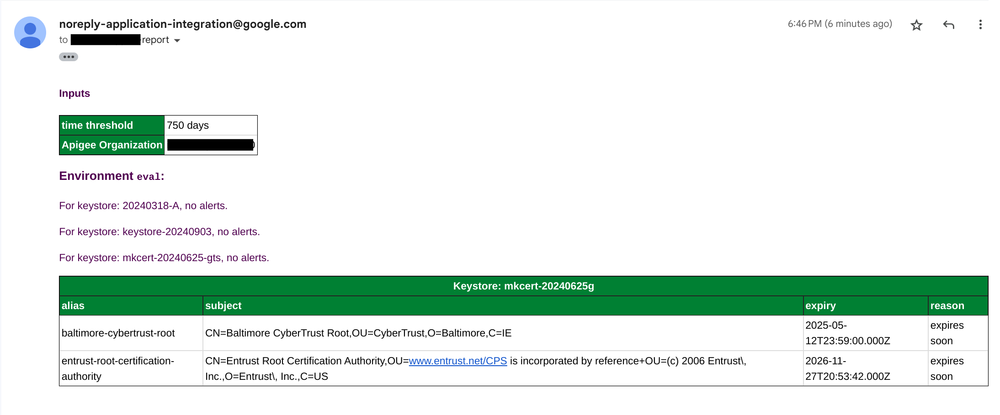
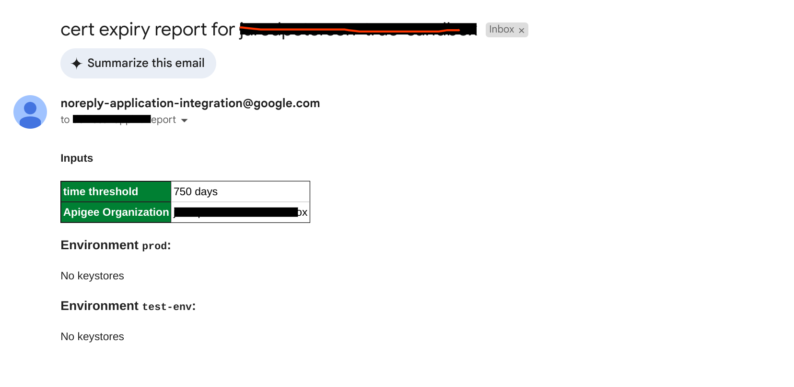

# An Integration for Apigee Certificate Checking

This is an Integration that runs on a schedule to check Certificates in Apigee
organizations, to see if any will be expiring "soon".

This integration runs in an automated fashion.
It sends an email after collecting results. The default schedule is nightly.

The email looks like this:


<!--  -->

If there are no keystores in the environments, the email looks like this:


<!--  -->


## Pre-requisites

- a bash-like shell.

- the gcloud cli, installed and available on your path.

- standard unix utilities like grep, sed, and tr

- You must be signed in (`gcloud auth login`) to an account that
  has access to each of the apigee projects you want to scan.
  The setup script will create a Service account in the
  App Integration project, and grant rights to that SA,
  as apigee.readOnlyAdmin on the Apigee projects.
  So your user must have the ability to run
  `gcloud projects add-iam-policy-binding PROJECT ...`
  on those Apigee projects.


## Setup

Modify the env.sh file to set variables suitable for your scenario.

You can set:
- `APPINT_PROJECT` - the project ID that will run the Integration. It must have integration already enabled.

- `REGION` - the region to use for the integration in your project.

- `EXAMPLE_NAME` - the name of the integration that will get created in your project.

- `APIGEE_PROJECTS` - a comma-separated list of project IDs (no spaces)

- `EMAIL_ADDR`- the email address that will get the report.


Save the file.

Then, source that script, and run the setup script.

```
source ./env.sh
./setup-cert-expiry-checker.sh
```

This takes just a few minutes.

If the setup completes successfully, it will finish by invoking the integration.
You should see some JSON output showing the status of that - in the happy case, output
variables of the integration.

Check the email inbox for the email address you specified in the environment
settings for the report.

At the end of the script output, you should see a link to the cloud console page
that will allow you to view the integration.

## Modifying

After the setup script succeeds, you will be able to modify and tweak the
integration interactively, using the Cloud Console UI. To do that, open the link
the script displayed in a browser. Use the TEST button, and specify the Schedule
trigger.

Note: The integration is set to execute on a schedule, nightly at 21:04.

If you want to run it against a _different_ set of Apigee projects than that
specified in the env.sh file, one option is start all over: to run the clean up
script, modify env.sh, source it again, and re-run the setup.

But there is an easier way to add a new prject: just enable the existing service
account with apigee.readOnlyAdmin role, on the new project or projects. There's
a script that can do _just that_:

```
./add-apigee-project.sh project-id-of-additional-apigee-org
```

Then you can use the Cloud Console UI to re-run the TEST with the Schedule
trigger, specifying the newly-added project.


## Re-running it

Use this script to just invoke the trigger from the command line:

```
./test-invoke-integration.sh
```

## Teardown

The cleanup script will remove everything the setup script had set up.

```
source ./env.sh
./clean-cert-expiry-checker.sh
```
